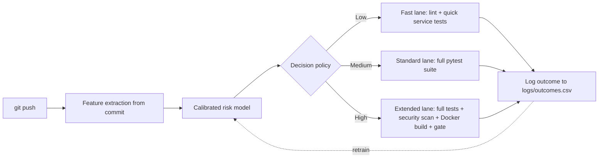

# Adaptive AI-Driven CI/CD - Research Integration

This repository is both a microservices application (the ETP design assignment)
and the live testbed for an MSc research project: an **adaptive, AI-driven CI/CD
framework** that predicts the risk of each pushed commit *before* the pipeline
runs and routes it through a lighter or heavier pipeline accordingly.

## How the research is applied here

The four microservices (gateway, checkout, pricing, inventory) and their pytest
suite are the real software the pipeline protects. Instead of running every stage
for every commit, the pipeline adapts:

- **predict.py** - extracts pre-build features from the commit and outputs a
  calibrated failure-risk score and a pipeline lane.
- **.github/workflows/adaptive-ci.yml** - runs only the lane matching the risk;
  each lane runs real checks on the services.
- **log_outcome.py** - records each prediction plus the real build outcome to
  `logs/outcomes.csv`, closing the learning loop. Fast-tracked commits that are
  not explored are logged as `unobserved` (censored feedback).
- **dashboard.html** - visualises compute saved, lane distribution, and outcomes.

## Model

The risk model is a calibrated logistic-regression classifier trained on the
TravisTorrent dataset (~3.9M CI builds). Offline it achieves PR-AUC 0.52
(vs 0.25 random) and is well-calibrated (ECE 0.012). Add the trained
`model.joblib` (exported from the training notebook) to the repository root, and
set the scikit-learn version in the workflow to match the training environment.

## Research contributions demonstrated in this repo

1. Pre-build, calibrated risk prediction (RQ1).
2. Cost-sensitive adaptive pipeline routing (RQ2).
3. Continuous learning with an exploration budget to counter censored feedback (RQ3).

## Setup

1. Add `model.joblib` to the repo root.
2. In the workflow, set `scikit-learn==<your Colab version>`.
3. Enable read/write workflow permissions (Settings -> Actions -> General).
4. (Optional) Create a `production` environment with required reviewers to enable
   the high-risk approval gate.
5. Push a commit and open the Actions tab.
